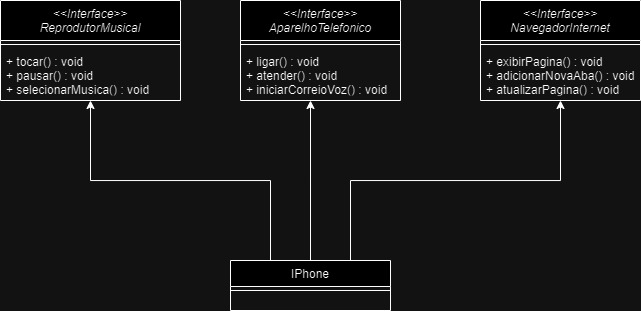

# Desafio IPhone

## Objetivo

Montar um diagrama UML conforme o que foi ensinado até o momento. O diagrama
deve seguir as seguintes orientações:

Comportamentos esperados:

- Repodutor Musicial: tocar, pausar, selecionarMusica
- Aparelho Telefônico: ligar, atender, iniciarCorrerioVoz
- Navegador na Internet: exibirPagina, adicionarNovaAba, atualizarPagina

## Resultado

